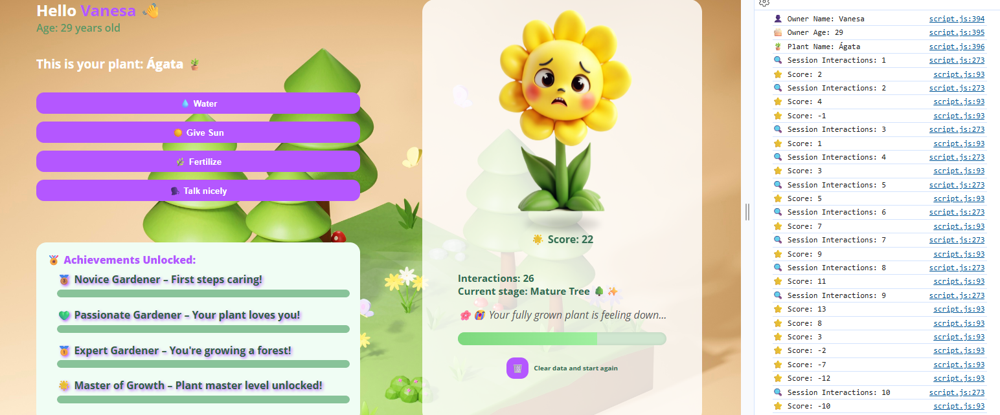

# 🌱 Virtual Plant Care App

Welcome to your own **Virtual Plant Companion**!  
This gamified application encourages users to care for a plant through simple interactions — watering, giving sun, fertilizing, and speaking kindly to it. As you care for your plant, it grows, unlocks achievements, and reacts emotionally depending on your actions. 👩‍🌾🌞🪴

---

## Features

- 🌿 Create and name your own plant and user profile.
- ⏳ Grow your plant through multiple visual stages.
- ✨ Earn badges as rewards for reaching care milestones.
- 🔄 Real-time feedback with sound effects, growth updates, and messages.
- 😢 The plant can feel neglected if ignored too long.
- ⭐ **Score system** that increases or decreases depending on the quality of your actions.

---

## Rules & Logic

### Point System (Score)
Your plant reacts to how well you take care of it. Each action can either **increase or decrease your score**:

| Action                          | Score Impact |
|----------------------------------|--------------|
| ✅ Good care action (well-timed) | +2 points    |
| ❌ Repeating the same action twice | -1 point     |
| ❌ Using fertilizer too early     | -5 points    |

> The current score is saved in `localStorage` and grows as your plant does! 🧪

### Achievements & Badges

You unlock medals based on how many interactions you've made:

- 🥉 **Novice Gardener** – 5 interactions
- 💚 **Passionate Gardener** – 10 interactions
- 🥇 **Expert Gardener** – 15 interactions
- 🌟 **Master of Growth** – 20 interactions

A popup will celebrate every new badge you earn! 🎉

---

## Live Demo & Screenshot

🌐 **Live Demo:** _Coming soon!_  
📷 **Screenshot:**



---

## 📁 Project Structure

```
Entregable/
│
├── assets/
│   ├── img/         → Plant growth stages, sad versions, favicon
│   └── sounds/      → Click sound for interactions
│
├── index.html       → Main file (home screen and interaction UI)
├── plant.html       → (Optional screen for extended features)
├── styles.css       → All styling and layout
├── script.js        → JavaScript logic (plant care, scoring, UI)
└── ReadMe.md        → You’re reading it! 
```

---

## Tech Stack

- **HTML5** – Semantic structure
- **CSS3** – Layout, responsiveness, and animations
- **JavaScript (Vanilla)** – DOM manipulation, logic, localStorage/sessionStorage

---

## How to Run

1. Download or clone the repository.
2. Open `index.html` in your browser.
3. Enter your name, age, and plant name to begin.
4. Start caring for your plant and unlocking achievements!

---

## 👩‍💻 Created By

**Vanesa Carrillo**  
_Creative developer, designer, and creator with a clear mission, to create joyful and meaningful digital experiences. 

